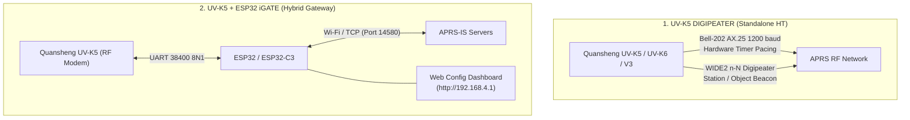

# NUSA UV-K5 APRS: Digipeater & iGate

[](https://github.com/stefendy-dotcom/NUSA-UVK5-APRS-DIGI-IGATE/releases)
[](https://github.com/stefendy-dotcom/NUSA-UVK5-APRS-DIGI-IGATE/releases)
[](https://github.com/stefendy-dotcom/NUSA-UVK5-APRS-DIGI-IGATE/releases)
[](https://github.com/stefendy-dotcom/NUSA-UVK5-APRS-DIGI-IGATE/releases)
[](https://github.com/stefendy-dotcom/NUSA-UVK5-APRS-DIGI-IGATE/releases)
[](https://github.com/stefendy-dotcom/NUSA-UVK5-APRS-DIGI-IGATE/releases)
[](https://github.com/stefendy-dotcom/NUSA-UVK5-APRS-DIGI-IGATE/releases)

Open-source APRS firmware ecosystem for the **Quansheng UV-K5 / UV-K6 / UV-5K** series, developed by **YF9UAG, Indonesia**.

> ✅ **Persistence Fix1 Maintenance Release:** Power-cycle EEPROM persistence fixes for DIGI (Normal/Standalone) and iGATE (Normal/Standalone) have been **tested successfully on real hardware**. See **[PERSISTENCE_FIX1.md](./PERSISTENCE_FIX1.md)**.

---

## 📑 Project Navigation & Quick Matrix

This repository houses two complete APRS implementations:



| Project | Target Hardware | Functionality | Current Stable Version | Quick Link |
|---|---|---|---|---|
| **UV-K5 DIGIPEATER** | Quansheng UV-K5 / UV-K6 | On-radio APRS Digipeater (Normal & Autostart Standalone) | Normal REV1G Fix1 / Standalone REV1H Fix1 | **[Open DIGIPEATER](./UV-K5%20DIGIPEATER/)** |
| **UV-K5 V3 DIGIPEATER** | Quansheng UV-K5 V3 Hardware | Dedicated Normal Digipeater for V3 PCB revision | Normal REV1A | **[Open UV-K5-V3](./firmware/UV-K5-V3/)** |
| **UV-K5 + ESP32 iGATE** | UV-K5 + ESP32 / ESP32-C3 | Bidirectional RF ↔ APRS-IS Internet Gateway | Normal REV1A Fix1 / Standalone REV1B Fix1 | **[Open iGATE](./UV-K5%20IGATE/)** |

---

# 1. UV-K5 DIGIPEATER

The Digipeater firmware turns a Quansheng UV-K5 handheld radio into a dedicated 1200 baud APRS digipeater without needing any external microcontroller.

### Key Features
* **Modem Engine:** Bell 202 AFSK (1200 Hz mark / 2200 Hz space) at 1200 baud with hardware-timer-based (`TIMER_BASE0`) deterministic TX bit pacing.
* **Digipeater Routing:** Standard AX.25 UI-frame digipeating with **WIDE2 n-N** path substitution and duplicate packet suppression (~20s).
* **Position & Object Beaconing:** Station position beacons or APRS Object beacons (`*` alive flag, `111111z` pseudo-timestamp) with TOCALL: `APZUAG`.
* **Fix1 EEPROM Persistence:** Full 9-character Object Name (`ObjNam`), 16-character Comment suffix (`BComnt`), and APRS Symbol settings stored safely across power cycles using CRC16 NAP3 formatting.

### Normal vs. Standalone Digipeater Variants

| Feature | REV1G Normal | REV1H Standalone Fix1 (Latest) |
|---|---|---|
| **Primary Use** | Flexible handheld radio + occasional APRS | 24/7 dedicated unattended digipeater appliance |
| **APRS Startup** | Manual (enter via **Long F2**) | **Automatic autostart** on radio power-on |
| **VFO Mode** | Normal dual VFO flexibility | Locked to VFO A simplex operation |
| **APRS Frequency** | Uses current VFO frequency | Dedicated **`APRFq`** keypad menu setting |
| **Beacon Types** | Station position beacon | Selectable **Station** or **APRS Object** (`BType`) |
| **Custom Symbol** | Fixed | Full Symbol Table (`SymTbl`) & Code (`Symbol`) entry |
| **Object Name** | N/A | Editable 9-character Object Name (`ObjNam`) |
| **Comment Suffix** | Fixed `NUSA DIGI` | Mandatory `NUSA DIGI` prefix + editable 16-char suffix (`BComnt`) |

### Digipeater Menu Reference (REV1H Standalone)

| Menu Item | Description | Example / Range |
|---|---|---|
| `TxPwr` | RF Transmit Power | LOW / MID / HIGH |
| `APRFq` | Dedicated APRS Frequency (in 10 Hz units) | `14439000` (144.390 MHz) / `14480000` (144.800 MHz) |
| `DgCall` | Digipeater Callsign | e.g., `9M2PJU` / `YF9UAG` |
| `DgSSID` | Digipeater SSID | `0` to `15` (Standard: `3` or `4`) |
| `DgDly` | TX Preamble Delay | `900` ms (recommended) |
| `DgTail` | TX Tail Duration | `60` ms |
| `PosBcn` | Beacon Timer Interval | OFF / Configurable Interval |
| `BType` | Beacon Type | `Station` / `Object` |
| `ObjNam` | APRS Object Name (when `BType=Object`) | up to 9 alphanumeric characters (e.g. `NUSA-DIGI`) |
| `BComnt` | User Comment Suffix | up to 16 characters (e.g. `KUALA LUMPUR`) |
| `SymTbl` | APRS Symbol Table | `/` (Primary) or `\` (Alternate) |
| `Symbol` | APRS Symbol Code | `#` (Digipeater), `s` (Ship), `&` (Gateway), etc. |
| `BLat` / `LatNS` | Beacon Latitude & North/South | Deg/Min/Sec coordinates + N/S |
| `BLon` / `LonEW` | Beacon Longitude & East/West | Deg/Min/Sec coordinates + E/W |

### Flashing the Digipeater Firmware

1. **Download the Firmware:**
   * **Normal (REV1G Fix1):** [`NUSA_UVK5_APRS_DIGI_REV1G.packed.bin`](./UV-K5%20DIGIPEATER/firmware/NUSA_UVK5_APRS_DIGI_REV1G.packed.bin)
   * **Standalone (REV1H Fix1):** [`NUSA_UVK5_APRS_DIGI_REV1H_STANDALONE.packed.bin`](./UV-K5%20DIGIPEATER/firmware/NUSA_UVK5_APRS_DIGI_REV1H_STANDALONE.packed.bin)
   * **UV-K5 V3 Hardware:** [`NUSA_UVK5_V3_APRS_DIGI_REV1A_NORMAL.bin`](./firmware/UV-K5-V3/NUSA_UVK5_V3_APRS_DIGI_REV1A_NORMAL.bin)
2. **Put UV-K5 into Bootloader Mode:**
   * Turn the radio off.
   * Hold the **PTT** button while turning the power knob on until the top flashlight LED turns on steady.
3. **Flash:**
   * For `.packed.bin` files: Use the official Quansheng updater or compatible web flashers.
   * For `.bin` files (V3): Use `k5prog` or a browser web flasher supporting raw binary flashing.

---

# 2. UV-K5 + ESP32 iGATE

The iGate setup combines the Quansheng UV-K5 as the RF transceiver/modem with an ESP32 or ESP32-C3 microcontroller connected to Wi-Fi and the APRS-IS backbone.

```text
               APRS RF (144.390 MHz / 144.800 MHz)
                              ▲
                              │ RF (Bell-202 AX.25)
                              ▼
                   ┌─────────────────────┐
                   │   Quansheng UV-K5   │
                   │    (Radio Modem)    │
                   └──────────┬──────────┘
                              │
                              │ UART 38400 8N1
                              │ (2.5mm Ring / 3.5mm Sleeve)
                              ▼
                   ┌─────────────────────┐
                   │   ESP32 / ESP32-C3  │
                   │  (Wi-Fi / Gateway)  │
                   └──────────┬──────────┘
                              │
                              │ TCP / Wi-Fi (Port 14580)
                              ▼
                   ┌─────────────────────┐
                   │    APRS-IS Server   │
                   │ (rotate.aprs2.net)  │
                   └─────────────────────┘
```

### Hardware Requirements
* Quansheng UV-K5, UV-K6, or UV-5K.
* ESP32 DevKit / WROOM-32 board OR ESP32-C3 board.
* Kenwood 2-pin K-type programming connector cable.
* Two $1\text{ k}\Omega$ current-limiting resistors.
* Snap-on ferrite choke (Type 43 or 31).

### Wiring & Connection Pinout


#### Classic ESP32 / WROOM-32 Pinout

| UV-K5 Kenwood Plug | UV-K5 Signal | Series Resistor | ESP32 GPIO Pin |
|---|---|---|---|
| **2.5 mm RING** | Radio UART TX (Output) | $1\text{ k}\Omega$ | **GPIO 16 (RX2)** |
| **2.5 mm SLEEVE** | Ground | Direct Wire | **GND** |
| **3.5 mm SLEEVE** | Radio UART RX / PTT (Input) | $1\text{ k}\Omega$ | **GPIO 17 (TX2)** |

#### ESP32-C3 Pinout

| UV-K5 Kenwood Plug | UV-K5 Signal | Series Resistor | ESP32-C3 Pin |
|---|---|---|---|
| **2.5 mm RING** | Radio UART TX | $1\text{ k}\Omega$ | **GPIO 4 (RX1)** |
| **2.5 mm SLEEVE** | Ground | Direct Wire | **GND** |
| **3.5 mm SLEEVE** | Radio UART RX | $1\text{ k}\Omega$ | **GPIO 5 (TX1)** |

> [!CAUTION]
> **DO NOT CONNECT THE 3.5 mm TIP!**  
> The 3.5 mm TIP carries full battery supply voltage ($+7.4\text{V} \sim +8.4\text{V}$). Connecting it to any ESP32 GPIO or ground will permanently destroy the microcontroller.
> * 2.5 mm TIP = Speaker Audio (Leave Disconnected)
> * 3.5 mm RING = Mic Bias (Leave Disconnected)
> * 3.5 mm TIP = Radio V+ (Leave Disconnected)

---

### ESP32 Flashing Instructions

The precompiled ESP32 4-BIN ZIP archives are located in [`UV-K5 IGATE/esp32/`](./UV-K5%20IGATE/esp32/):

#### A. Classic ESP32 (WROOM-32 / Dev Module)
Extract [`NUSA_UVK5_ESP32_IGATE_REV1A_BIN.zip`](./UV-K5%20IGATE/esp32/NUSA_UVK5_ESP32_IGATE_REV1A_BIN.zip) and flash using `esptool`:

```bash
python -m esptool --chip esp32 --port /dev/ttyUSB0 --baud 460800 erase-flash

python -m esptool --chip esp32 --port /dev/ttyUSB0 --baud 460800 write-flash \
  0x1000  NUSA_UVK5_ESP32_IGATE_REV1A_bootloader.bin \
  0x8000  NUSA_UVK5_ESP32_IGATE_REV1A_partitions.bin \
  0xE000  NUSA_UVK5_ESP32_IGATE_REV1A_boot_app0.bin \
  0x10000 NUSA_UVK5_ESP32_IGATE_REV1A_firmware.bin
```

#### B. ESP32-C3 RISC-V Module
Extract [`NUSA_UVK5_ESP32C3_IGATE_REV1A_BIN.zip`](./UV-K5%20IGATE/esp32/NUSA_UVK5_ESP32C3_IGATE_REV1A_BIN.zip) and flash using `esptool`:

```bash
python -m esptool --chip esp32c3 --port /dev/ttyUSB0 --baud 460800 erase-flash

python -m esptool --chip esp32c3 --port /dev/ttyUSB0 --baud 460800 write-flash \
  0x0     NUSA_UVK5_ESP32C3_IGATE_REV1A_bootloader.bin \
  0x8000  NUSA_UVK5_ESP32C3_IGATE_REV1A_partitions.bin \
  0xE000  NUSA_UVK5_ESP32C3_IGATE_REV1A_boot_app0.bin \
  0x10000 NUSA_UVK5_ESP32C3_IGATE_REV1A_firmware.bin
```

---

### ESP32 Web Dashboard Configuration

1. Power on the flashed ESP32.
2. Connect to the Wi-Fi Access Point:
   * **SSID:** `NUSA-IGATE`
   * **Password:** `12345678`
3. Open your browser to **`http://192.168.4.1/`**.
4. Configure your station:
   * **Wi-Fi SSID & Password:** Your local home/repeater network credentials.
   * **APRS Callsign & SSID:** e.g., `9M2PJU-10` or `YF9UAG-10`.
   * **APRS-IS Passcode:** Your 5-digit APRS-IS validation code.
   * **APRS-IS Server:** `rotate.aprs2.net` (Port: `14580`).
   * **Beacon Settings:** Coordinates, beacon comment, interval, and symbol.
5. Save and restart the ESP32.

---

## ⚡ Hardware, Power & RFI Protection Guidelines

> [!IMPORTANT]
> When operating an iGate or Digipeater in permanent 24/7 service, follow these essential hardware practices:

1. **RF Interference (RFI) Mitigation:**
   * Transmitting at 4W–5W VHF/UHF immediately adjacent to an unshielded ESP32 board can induce high RF currents into the UART wires, causing MCU crashes, Wi-Fi drops, or serial corruptions.
   * **Snap-on Ferrite Choke:** Clip a Type 43 or Type 31 ferrite core onto the Kenwood cable as close to the radio body as possible.
   * **Antenna Separation:** Maintain at least $20\text{ cm} \sim 30\text{ cm}$ physical separation between the radio's antenna and the ESP32 module.
2. **24/7 Base Station Powering:**
   * **Do NOT use the UV-K5 onboard USB-C port** for continuous 24/7 power. The internal charge controller generates significant heat and is not rated for continuous high-duty-cycle TX/RX.
   * **Recommended Power Source:** Use a dedicated 12V-to-8.4V battery eliminator inserted into the radio's battery compartment powered by a clean, regulated DC supply.
3. **Stable ESP32 Power:**
   * Power the ESP32 with a dedicated 5V 1A+ DC supply with adequate bulk capacitance to avoid brownout resets when Wi-Fi TX bursts occur simultaneously with radio UART activity.

---

## 🔒 SHA256 Checksums Table

| File | Subdirectory | SHA256 Hash |
|---|---|---|
| `NUSA_UVK5_APRS_DIGI_REV1G.packed.bin` | `UV-K5 DIGIPEATER/firmware/` | `51b89ff9bb9bdbf141b44f0ffc362a2e0cd9007d4ece376c5d863209a3befa5f` |
| `NUSA_UVK5_APRS_DIGI_REV1G_STANDALONE.packed.bin` | `UV-K5 DIGIPEATER/firmware/` | `70202070d8373dc4a383800cc1bfd6cf4e6aae79cc73e52efc7828484fd48813` |
| `NUSA_UVK5_APRS_DIGI_REV1H_STANDALONE.packed.bin` | `UV-K5 DIGIPEATER/firmware/` | `d567603ced9ef646109e2049218ab65d71028ec7572b09f33d12ca27e87e47b2` |
| `NUSA_UVK5_V3_APRS_DIGI_REV1A_NORMAL.bin` | `firmware/UV-K5-V3/` | `248f9835e34d5b084966f9802c2921e2d08ce957093d14e499b5fdf8f867665f` |
| `NUSA_UVK5_IGATE_REV1A.packed.bin` | `UV-K5 IGATE/firmware/` | `675b32bbda58a71d333af5b0fa4e8ec7d8eb664f25e672712c701573a74855a7` |
| `NUSA_UVK5_IGATE_REV1A_STANDALONE.packed.bin` | `UV-K5 IGATE/firmware/` | `be97c352f1b0a48081b4bfdf78791f088439627d69b8ad7d75f0042720d92253` |
| `NUSA_UVK5_IGATE_REV1B_STANDALONE.packed.bin` | `UV-K5 IGATE/firmware/` | `0080f7ea35f2e84489c341c3987aeabc9eea04cc00e1c8edbe9dd5c68b098460` |
| `NUSA_UVK5_ESP32_IGATE_REV1A_BIN.zip` | `UV-K5 IGATE/esp32/` | `cedb74e3bae16b0789b4135c966049a61c8944219ababb0da35dc8d7aace6fcc` |
| `NUSA_UVK5_ESP32C3_IGATE_REV1A_BIN.zip` | `UV-K5 IGATE/esp32/` | `c88e93f0744ef3786f3312b0aa5287b150a2920222ee76bcfdf9fa33fc13721e` |

---

## ❓ Frequently Asked Questions & Troubleshooting

<details>
<summary><b>Q: My settings (Object Name / Comment) are lost after turning the radio off and on.</b></summary>
Ensure you have flashed the Fix1 release (REV1H Standalone Fix1 or REV1B Standalone Fix1). In older releases, EEPROM writes were limited to 1 page (8 bytes). Fix1 expands metadata storage to 5 pages with CRC16 NAP3 protection. After flashing Fix1, enter your settings in the menu once and save to write the full 40-byte record.
</details>

<details>
<summary><b>Q: My ESP32 resets or drops Wi-Fi whenever the radio transmits.</b></summary>
This is caused by Radio Frequency Interference (RFI) coupling into the UART lines or power supply.
1. Add a Type 43 snap-on ferrite core to the Kenwood programming cable.
2. Move the ESP32 at least 20–30 cm away from the radio antenna.
3. Ensure you have the 1 kΩ series resistors on both UART lines (TX & RX).
</details>

<details>
<summary><b>Q: How do I enter APRS mode on Normal firmware?</b></summary>
On REV1G Normal (Digi) or REV1A Normal (iGate), long-press the <b>F2</b> side key. If F2 Long is not configured for APRS, adjust it in the radio settings menu. On Standalone firmware (REV1H/REV1B), the radio enters APRS mode automatically at boot.
</details>

---

## 📚 Documentation & Releases

* **Digipeater Documentation:** [English Guide](./UV-K5%20DIGIPEATER/README.md) • [Panduan Bahasa Indonesia](./UV-K5%20DIGIPEATER/README_ID.md) • [Changelog](./UV-K5%20DIGIPEATER/CHANGELOG.md) • [REV1G vs Standalone Comparison](./UV-K5%20DIGIPEATER/REV1G_VS_STANDALONE_EN.md)
* **iGate Documentation:** [English Guide](./UV-K5%20IGATE/README.md) • [Panduan Bahasa Indonesia](./UV-K5%20IGATE/README_ID.md) • [Flashing Guide](./UV-K5%20IGATE/FLASHING.md) • [Changelog](./UV-K5%20IGATE/CHANGELOG.md)
* **UV-K5 V3 Documentation:** [V3 Guide](./firmware/UV-K5-V3/README.md)
* **Persistence Fix1 Details:** [PERSISTENCE_FIX1.md](./PERSISTENCE_FIX1.md)

### GitHub Releases
* **Digipeater Normal REV1G Fix1:** [`rev1g-fix1`](https://github.com/stefendy-dotcom/NUSA-UVK5-APRS-DIGI-IGATE/releases/tag/rev1g-fix1)
* **Digipeater Standalone REV1H Fix1:** [`rev1h-standalone-fix1`](https://github.com/stefendy-dotcom/NUSA-UVK5-APRS-DIGI-IGATE/releases/tag/rev1h-standalone-fix1)
* **iGate Normal REV1A Fix1:** [`igate-rev1a-fix1`](https://github.com/stefendy-dotcom/NUSA-UVK5-APRS-DIGI-IGATE/releases/tag/igate-rev1a-fix1)
* **iGate Standalone REV1B Fix1:** [`igate-rev1b-standalone-fix1`](https://github.com/stefendy-dotcom/NUSA-UVK5-APRS-DIGI-IGATE/releases/tag/igate-rev1b-standalone-fix1)

---

## 📜 License & Attribution

See the repository [LICENSE](./LICENSE) and [NOTICE](./UV-K5%20DIGIPEATER/NOTICE) files. Derived from the open-source Quansheng firmware ecosystem (DualTachyon, bg7nzl, phdlee, fagci, egzumer, OneOfEleven).
